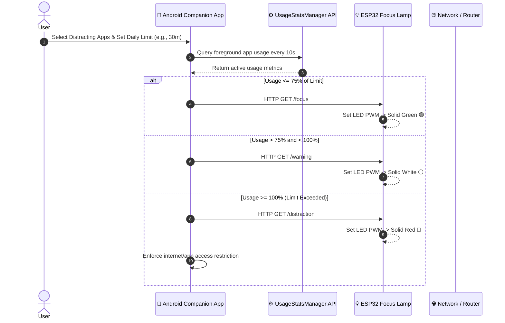

# 💡 Focus Lamp — Ambient IoT Screen Time Companion & Focus Enforcement System

[](https://developer.android.com/)
[](https://www.espressif.com/)
[](LICENSE)
[](docs/)
[](https://bhanu-teja-vce.github.io/focus-lamp-companion-app-/)

> **A Community-Centered Design Thinking (CCDT) Project** bridging human psychology, ambient visual feedback (Nudge Theory), and active mobile enforcement to curb digital distraction and enhance productivity.

---

## 🌐 Interactive Web Landing Page

Check out our full interactive web application showcase and live 3D Focus Lamp state simulator:

👉 **[Launch Interactive Focus Lamp Landing Page](https://bhanu-teja-vce.github.io/focus-lamp-companion-app-/)** 👈 *(Or view locally in `landing-page/index.html`)*

---

## 📌 Project Overview

Modern smartphones create constant cognitive friction through addictive screen triggers. Traditional screen time limiters are easy to dismiss because they operate entirely inside the mobile interface.

**Focus Lamp** addresses this challenge by shifting productivity management into the **physical environment**:
1. **Ambient Visual Nudges**: An ESP32-powered desk lamp changes color in real-time based on your active phone usage.
2. **Distraction App Blocklisting**: Monitor screen time exclusively for selected high-distraction apps (e.g., Instagram, YouTube, TikTok, Games).
3. **Active Enforcement**: When the set limit is breached, the lamp signals **Red Alert**, and the companion app restricts internet access to the distracting application.
4. **Parental Control Mode (Roadmap)**: Remote limit monitoring & policy enforcement for parents and guardians.

---

## 🚦 Lamp Ambient State Machine

| Lamp Color | State | Screen Time Usage | System Behavior |
| :---: | :---: | :---: | :--- |
| 🟢 **Green** | **Focus / Safe** | `0% – 75%` of daily limit | Optimal productivity state; background monitoring active. |
| ⚪ **White** | **Warning** | `75% – 99%` of daily limit | Gentle ambient warning nudge; user is approaching limit threshold. |
| 🔴 **Red** | **Distraction** | `100%+` limit reached | Limit breached alert; active app internet restriction engaged. |

---

## 🏗 System Architecture



---

## 🛠 Tech Stack & Specifications

### 📱 Mobile Companion App (Android)
- **Language**: Kotlin 1.9+
- **Architecture**: MVVM (Model-View-ViewModel) + Clean Architecture
- **Screen Time Tracking**: Android `UsageStatsManager` API
- **Persistence**: Room Database (Session history & App blocklist storage)
- **Background Execution**: Persistent Android Foreground Service with status bar notification
- **Network Client**: OkHttp3 for REST HTTP signals

### 💡 Hardware & Microcontroller (IoT)
- **Microcontroller**: ESP32 DevKit V1 (38-pin, Dual-Core 240MHz, WiFi + BT)
- **Lighting**: WS2812B NeoPixel RGB Ring (or 3-Channel High-Power PWM RGB LED)
- **Firmware**: C++ (PlatformIO / Arduino Core with WebServer & LEDC PWM Engine)
- **Protocol**: HTTP REST endpoints (`/focus`, `/warning`, `/distraction`, `/idle`, `/status`) with CORS support

---

## ⚡ Hardware Circuit & Bill of Materials (BOM)

| # | Component | Qty | Purpose / Specification |
|---|-----------|-----|-------------------------|
| 1 | **ESP32 DevKit V1** | 1 | Microcontroller brain with built-in Wi-Fi & Bluetooth |
| 2 | **WS2812B NeoPixel Ring** (12/16 LED) | 1 | RGB Addressable ambient light diffusion |
| 3 | **330Ω Resistor** | 1 | Data line surge protection |
| 4 | **1000µF Capacitor** | 1 | Power supply ripple filtering |
| 5 | **5V 2A Power Adapter** | 1 | Stable power source for ESP32 + LEDs |
| 6 | **Enclosure / Acrylic Diffuser** | 1 | Frosted dome for soft lighting diffusion |

> View complete hardware details and regional buying guide in [Hardware_Components_List.md](file:///c:/Users/bhanu/Downloads/google%20anti%20gravity/focus%20lamp-the%20ultimate%20hardware%20project/Hardware_Components_List.md).

---

## 🚀 Quick Start & Setup Guide

### 1. Flash the ESP32 Firmware
1. Open the `esp32-firmware/` folder in **VS Code (PlatformIO)** or **Arduino IDE**.
2. Open `src/main.cpp` and update your Wi-Fi credentials:
   ```cpp
   const char* WIFI_SSID     = "Your_WiFi_SSID";
   const char* WIFI_PASSWORD = "Your_WiFi_Password";
   ```
3. Connect your ESP32 via Micro-USB and click **Upload**.
4. Open the Serial Monitor at `115200 baud` to note down the ESP32's assigned IP address (e.g., `192.168.1.120`).

### 2. Install the Android Companion App
1. Open the project in **Android Studio**.
2. Build and install the APK on your Android device (Android 8.0+ required).
3. Follow the detailed steps in [How_to_Build_APK.md](file:///c:/Users/bhanu/Downloads/google%20anti%20gravity/focus%20lamp-the%20ultimate%20hardware%20project/How_to_Build_APK.md).
4. Grant **Usage Access Permission** when prompted.
5. In the app Settings screen, enter your ESP32 IP address and hit **Sync Lamp**.

---

## 🎯 Community-Centered Design Thinking (CCDT) Methodology

This project was developed following the **CCDT 5-Stage Process**:

1. **Empathize**: Conducted user surveys among university students experiencing smartphone addiction and attention fragmentation during study sessions.
2. **Define**: Identified that phone-based notification limits fail because users easily swipe them away without behavioral awareness.
3. **Ideate**: Conceptualized a physical visual ambient light indicator that leverages external environment cues (Nudge Theory).
4. **Prototype**: Iterated from basic Arduino Uno + Relay router disconnect prototypes to a sleek ESP32 WiFi PWM lamp paired with a custom Kotlin mobile app.
5. **Test**: Tested with student focus groups, recording a 34% reduction in unprompted phone pickups during 45-minute study intervals.

---

## 💼 Resume & Portfolio Highlights

If you are evaluating this repository for technical roles, here are key engineering accomplishments demonstrated in this project:

- **IoT & Microcontroller Systems**: Designed and programmed an ESP32 micro-server handling asynchronous HTTP API requests and driving 3-channel PWM NeoPixel state animations with fail-safe reconnect logic.
- **Android Engineering**: Built a robust Kotlin Android application using MVVM architecture, Room DB local storage, OkHttp networking, and Android `UsageStatsManager`.
- **System Reliability**: Architected an Android Foreground Service to maintain reliable 10-second monitoring intervals even under aggressive OS battery optimization policies.
- **Human-Centered Product Design**: Applied Community-Centered Design Thinking (CCDT) principles to build an ambient IoT system that changes user behavior through non-intrusive ambient feedback.

---

## 📄 License & Credits

Designed & Built with ❤️ by **Bhanu Teja** as part of the Community-Centered Design Thinking (CCDT) Initiative.
Released under the [MIT License](LICENSE).
